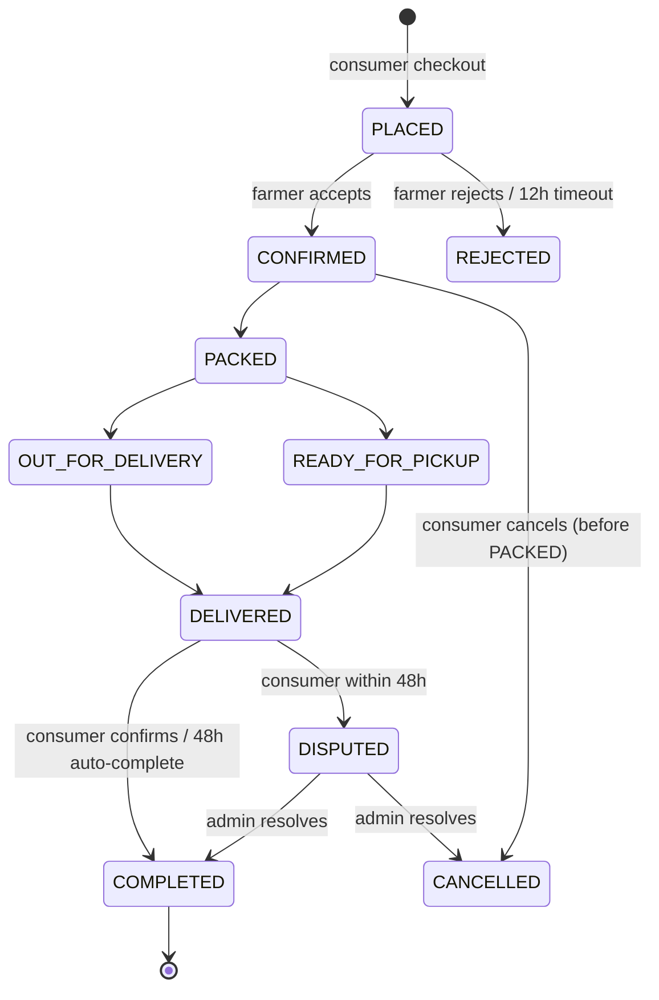

# 3. Business Logic

## 3.1 Order lifecycle (state machine)

Every order is a document that moves through explicit states. Each transition is appended to an `order_events` sub-collection (who, when, from-state, to-state) — a free audit trail that also powers the order-tracking UI.

| State | Triggered by | What happens |
|---|---|---|
| PLACED | Consumer checkout | Stock is atomically reserved inside a Firestore transaction; payment is simulated (MVP) or captured to escrow (roadmap). |
| CONFIRMED | Farmer accepts | Reservation becomes a committed sale. If the farmer does not act within 12 hours, the order auto-cancels and stock is restored. |
| PACKED / OUT_FOR_DELIVERY / READY_FOR_PICKUP | Farmer | Consumer sees live status; delivery type follows the option chosen at checkout (farmer delivery or self-pickup). |
| DELIVERED → COMPLETED | Farmer marks delivered; consumer confirms (or 48 h auto-complete) | On COMPLETED the review window opens and (roadmap) escrow funds release to the farmer. |
| CANCELLED / REJECTED | Either party (rules above) | Stock restored in the same transaction; (roadmap) refund issued from escrow. |
| DISPUTED | Consumer within 48 h of delivery | Frozen until admin resolves to COMPLETED or CANCELLED. |

## 3.2 Inventory integrity & the harvest-batch model

- **Single writer:** only the Flask backend mutates stock, inside Firestore transactions. Two consumers buying the last 2 kg simultaneously can never both succeed — one transaction retries, sees zero stock, and fails cleanly.
- **Batches, not bare products:** a product (e.g., "Tomatoes") has one or more batches: `{quantity, unit, price, harvest_date, is_ugly, discount_pct}`. Listings sell from batches.
- **Freshness score:** computed from `harvest_date` vs. a per-category shelf life (leafy greens 3 days, fruit 7, roots 14, eggs 21). Shown as a badge (Fresh today / 2 days old / …).
- **Auto-discount rule:** when a batch passes 60% of its shelf life the backend applies a configurable discount (default 20%) — produce sells instead of rotting, reinforcing the anti-waste story.

## 3.3 Ugly Produce Marketplace

- A batch flagged `is_ugly` gets a mandatory discount (default 30–50%, farmer-chosen) and appears in a dedicated "Ugly but Tasty" section with its own filter.
- Every ugly-batch sale increments a "kg saved from waste" counter on the farmer dashboard and a platform-wide total on the home page — turning a feature into a measurable impact metric for demos and reports.

## 3.4 Group buying

A group order is: `{batch, target_qty, discounted_price, deadline, radius_km}`. Flow:

1. A farmer (or the first interested consumer) opens a group order on a batch, e.g. "25 kg onions at ₹18/kg instead of ₹24, closes in 24 h".
2. Consumers within the radius join with a chosen quantity. Joins are transactional: the running total can never exceed `target_qty` (the last join is capped or rejected).
3. At the deadline: if the target is met, one confirmed order per member is created at the discounted price and batch stock is decremented once. If not met, the group auto-cancels and (roadmap) authorised payments are released.
4. Members may leave freely until the group reaches 80% of target; after that, leaving requires the deadline to pass.

**MVP simplification:** deadline resolution runs when the group page is next loaded or via a manual admin action; the roadmap moves this to a GitHub Actions cron hitting a backend endpoint.

## 3.5 Trust & verification

- **Farmer KYC queue:** on registration a farmer uploads a government ID photo and a land record / FPO membership proof (to Cloudinary). The account can list products immediately but shows "verification pending"; an admin approves from a review queue, which awards the **Verified Farmer** badge shown on listings and the map.
- **Verified-purchase reviews:** the review form only unlocks for a consumer with a COMPLETED order for that product — no drive-by ratings. Farmer rating = average over verified reviews.
- **Reports & moderation:** any listing or review can be reported with a reason; reports land in the admin queue with hide/dismiss actions.

## 3.6 Payments & escrow (roadmap design — no rework needed later)

- MVP checkout ends with a **simulated payment step** (order is created as PLACED with `payment_mode = "COD/simulated"`). The order state machine is identical either way.
- **Roadmap:** Razorpay Test Mode (free, no business KYC, real checkout UI with test cards/UPI). Flow: capture on PLACED → funds recorded in a `ledger` collection as held → released to the farmer's wallet balance on COMPLETED → refunded on CANCELLED/DISPUTED. The ledger is append-only, giving a full money audit trail.
- Because only the backend writes orders and the ledger, swapping the simulated step for Razorpay's webhook is a contained change to two endpoints.
